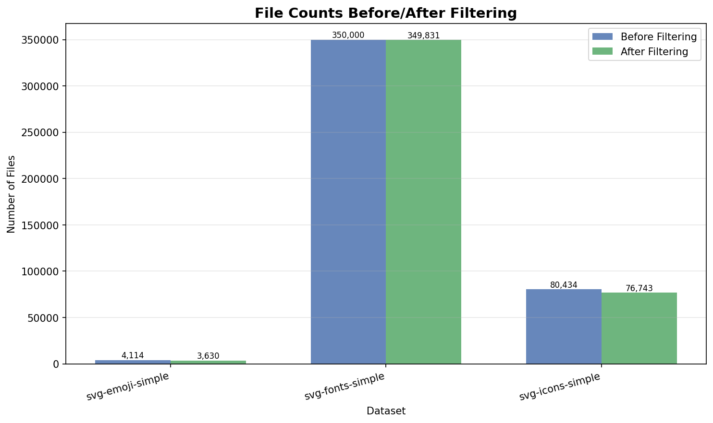
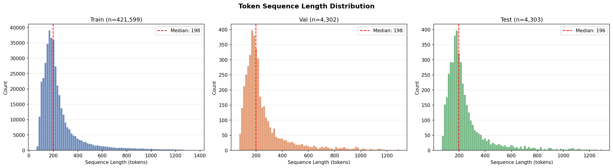
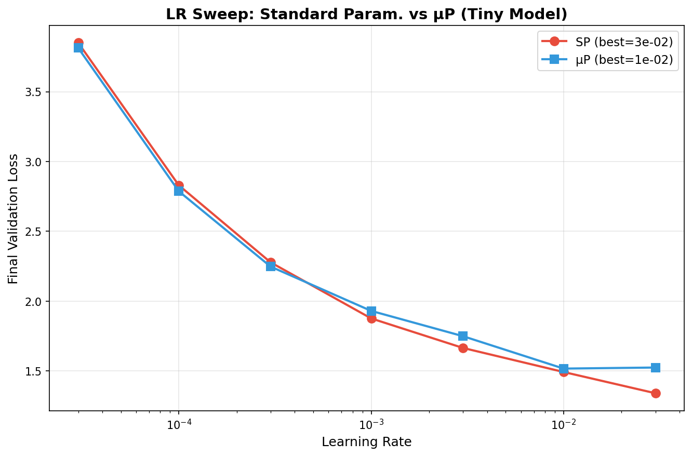
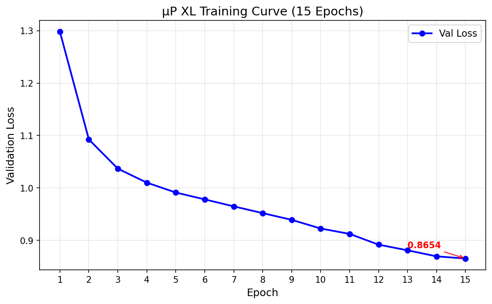

# Transformer Scaling Laws on SVG Data
## Final Project Report

**Author:** Ananya Singh (AS21114)
**Date:** April 30, 2026

---

## 1. Introduction

### Motivation for Studying Scaling Laws on SVG Data
The scaling behavior of Transformer language models on natural language and code is well-documented, demonstrating that model performance predictably improves as parameter count, dataset size, and compute increase (Kaplan et al., 2020; Hoffmann et al., 2022). However, applying these models to Scalable Vector Graphics (SVG) introduces a unique modality: a structured, deterministic XML-based language that directly represents 2D visual information. Unlike natural language, which is highly semantic and context-dependent, SVG is fundamentally syntactic, geometric, and mathematical. 

Studying scaling laws on SVG data allows us to investigate whether the predictable capacity improvements seen in semantic text generation apply to geometric reasoning and structural XML synthesis. Are Transformers as effective at learning the spatial coordinates of a multi-path icon as they are at learning the grammar of English? Furthermore, SVGs offer an objective evaluation metric—visual rendering and structural validity—providing a clear proxy for model understanding that escapes the subjectivity of text-based metrics like BLEU or ROUGE.

### Overview of Approach
This project implements a complete pipeline to train and evaluate decoder-only Transformer models on SVG generation. The pipeline operates in four phases:
1. **Data Collection & Preprocessing:** Assembling, cleaning, and tokenizing a 110.5M token corpus from HuggingFace datasets.
2. **Standard Parameterization (SP) Scaling:** Evaluating the baseline scaling properties of 5 models (1.2M to 87.3M parameters) using a standard fixed-learning-rate approach.
3. **Maximal Update Parameterization (μP) Scaling:** Implementing μP to stabilize hyperparameter transfer across widths and comparing the resulting scaling laws.
4. **Best Model Training & Generation:** Taking the best-performing model (μP XL), training it for 15 epochs, and evaluating its generative capabilities through unconditional, prefix-conditioned, and temperature-varied sampling.

---

## 2. Data

### Dataset Description and Preprocessing Pipeline
The training corpus was assembled from three StarVector datasets hosted on HuggingFace: `svg-fonts-simple`, `svg-icons-simple`, and `svg-emoji-simple`. The raw dataset consisted of 434,548 SVG files.

We implemented a rigorous two-pass preprocessing pipeline:
1. **Cleaning**: We parsed the SVGs using `lxml` to ensure XML validity, removed all non-essential tags (`<metadata>`, `<desc>`, `<title>`), stripped namespace URIs and editor-specific attributes (e.g., Inkscape metadata), and collapsed redundant whitespace. To reduce vocabulary fragmentation and sequence length, we normalized all coordinate floats to a single decimal place (e.g., `12.000` → `12.0`). 
2. **Filtering**: We discarded files shorter than 50 characters (often empty wrappers) or longer than the 99th percentile (5,117 characters) to remove extreme outliers that would overly constrain batching contexts. 

After filtering, 430,204 files remained. 



### Tokenization Scheme
**Tokenization Strategy:** We utilized a Byte-Level Byte-Pair Encoding (BPE) tokenizer trained specifically on the cleaned SVG corpus using the HuggingFace `tokenizers` library. Byte-Level BPE was chosen because it natively handles XML special characters (`<`, `>`, `"`, `/`) without generating `<unk>` tokens, preserving the exact string structures necessary for valid SVGs.

**Vocabulary Size (2,048):** We selected a highly constrained vocabulary size of 2,048. SVGs have a restricted global vocabulary composed of a few XML tags (`<svg>`, `<path>`), attributes (`viewBox`, `fill`, `d`), path commands (`M`, `L`, `C`, `Z`), and floating-point coordinates. A larger vocabulary (e.g., 50K) would be largely unutilized and would needlessly inflate the embedding matrix, crippling the parameter efficiency of the smaller models (Tiny/Small) in our scaling study. 

*Example Tokenization:*
A sequence like `<path d="M12.0 2.0 L` might be tokenized into `["<path", " d=\"", "M12.0", " 2.0", " L"]`. By keeping the vocabulary small, the tokenizer learned to group common coordinate strings while breaking down rare ones into digits and decimals. The tokenizer achieved an efficiency of 3.95 characters per token.

### Statistics
The final tokenized corpus contained **110,475,857 tokens**. The data was split at the file level (to prevent data leakage within a single SVG) into Train (98%, 108.3M tokens), Validation (1%, 1.1M tokens), and Test (1%, 1.1M tokens) sets.



The sequence length histogram shows a median length of 198 tokens, with the 90th percentile around 500 tokens. This distribution directly informed our architectural choice of a 1,024-token context window.

---

## 3. Methods

### Model Architectures
We utilized a decoder-only Transformer architecture adapted from nanoGPT. Features included Flash Attention, pre-LayerNorm, and GELU activations. 

To conduct our scaling study, we defined five model sizes. For the Maximal Update Parameterization (μP) experiments, we removed embedding/LM-head weight tying and introduced the `MuReadout` layer, resulting in slightly higher parameter counts for μP compared to SP.

| Model Size | d_model | n_layer | n_head | d_ff | SP Params | μP Params |
|------------|---------|---------|--------|------|-----------|-----------|
| Tiny       | 128     | 4       | 4      | 512  | 1.18M     | 1.44M     |
| Small      | 192     | 6       | 6      | 768  | 3.25M     | 3.64M     |
| Medium     | 384     | 6       | 6      | 1536 | 11.8M     | 12.6M     |
| Large      | 512     | 10      | 8      | 2048 | 33.0M     | 34.1M     |
| XL         | 768     | 12      | 12     | 3072 | 87.3M     | 88.9M     |

**Context Window Length:** We used a context length of 1,024 tokens. Given the sequence length distribution (P90 < 500), a 1024-token window comfortably encapsulates >99% of our SVG files without truncation, while remaining computationally feasible for the XL model on an A100 GPU.

### Training Setup and Hyperparameters
Models were trained using mixed precision (bfloat16) on an NVIDIA A100-SXM4-80GB GPU. 
- **Batch Size:** A global batch size of 65,536 tokens was achieved via gradient accumulation (16 sequences × 1024 tokens × 4 accumulation steps).
- **Optimizer & Schedule:** We utilized AdamW (for SP) and MuAdamW (for μP) with $\beta_1=0.9$, $\beta_2=0.95$, and a weight decay of $0.1$. The learning rate followed a cosine decay schedule with a 5-10% linear warmup, decaying to 10% of the peak LR.
- **Regularization:** During the short 1-epoch scaling studies, dropout was disabled (0.0) to measure pure model capacity. For the extended 15-epoch training of the XL model, we introduced a dropout of 0.1 to mitigate overfitting.

### Experimental Design for Scaling Studies
Our scaling study evaluated Standard Parameterization (SP) versus Maximal Update Parameterization (μP):
1. **Learning Rate Sweeps**: Log-scale sweeps (from `3e-5` to `3e-2`) were performed on the Tiny model for both SP and μP to find the empirical optimal learning rate.
2. **Zero-Shot Transfer**: Using the single best LR found on the Tiny model, we trained all 5 models (Tiny through XL) for exactly 1 epoch (~108M tokens) to observe scaling behavior and hyperparameter stability across widths.

### Evaluation Metrics
Quantitative evaluations relied on validation cross-entropy loss and test perplexity. Generative evaluations relied on:
- **XML Validity:** Does the output parse flawlessly via standard XML parsers?
- **Render Success:** Can `cairosvg` rasterize the SVG to a PNG without throwing fatal errors?
- **Structural Correctness:** Does the output contain the required SVG elements (`<svg>`, `viewBox`, `<path>`)?

---

## 4. Results

### Learning Rate Sweeps and Fixed LR vs. μP Comparison
The SP learning rate sweep on the Tiny model selected `3.0e-02`, showing a monotonically decreasing loss curve. The μP LR sweep selected `1.0e-02`, revealing a clear U-shaped curve. 



When transferring these learning rates to the larger models, the difference in parameterization became stark:
- **SP Failed to Scale:** Under SP, the fixed LR of `3.0e-02` was too aggressive for wider models. The Medium, Large, and XL models diverged catastrophically, yielding validation losses of ~3.2–3.4 (near random initialization).
- **μP Succeeded:** Under μP, the fixed LR of `1.0e-02` transferred perfectly. `MuAdamW` automatically scaled the effective per-layer learning rate by $1/width\_mult$. All five models converged smoothly.

| Model | SP Val Loss | μP Val Loss |
|-------|-------------|-------------|
| Tiny  | 1.3416      | 1.5393      |
| Small | 1.3092      | 1.5169      |
| Medium| 3.2161 (Diverged) | 1.4073      |
| Large | 3.3118 (Diverged) | 1.4637      |
| XL    | 3.3867 (Diverged) | **1.3258**  |

### Transformer Scaling Plot and Extrapolation
Because SP models diverged, an SP power-law scaling fit was mathematically invalid (yielding negative scale parameters). The μP scaling curve behaved monotonically (with a slight bump at Large, likely due to depth adjustments) from 1.54 to 1.33.

Fitting the standard Kaplan power law ($L = a \cdot N^{-\alpha} + c$) to the μP results yielded a near-zero exponent ($L = 281.65 \cdot N^{-0.0002} - 279.45$). Extrapolating this to a 10× larger model (873M parameters) predicts a loss of ~1.32. However, this near-horizontal prediction is an artifact of the severe compute constraints (1 epoch) of the scaling study, rather than a true theoretical limit.

### Best Model Extended Training (μP XL)
We selected the best-performing model, **μP XL** (88.9M parameters), for extended training over 15 epochs (~1.6 billion tokens). 



The model exhibited continuous, smooth convergence:
- **Validation Loss:** Decreased from 1.30 (Epoch 1) to **0.8654** (Epoch 15).
- **Test Loss:** 0.8557
- **Test Perplexity:** **2.35**

The training curve shows no signs of overfitting. At epoch 15, the curve is still pointing downward, indicating the model possesses sufficient capacity to absorb even more data.

### Generated Samples with Evaluation
We evaluated the final μP XL model using nucleus sampling (`top_p=0.95`). For inputs that hit the 1,024 token limit and truncated mid-tag, we applied a custom heuristic repair script (closing unclosed quotes and tags, and appending `</svg>`).

#### Unconditional Generation
We generated 15 unconditional samples (starting from the `<bos>` token). 
- **XML Validity:** 93% (14/15)
- **Render Rate:** 93% (14/15)
- **Structural Validity:** 100% 


The model overwhelmingly learned to generate font glyphs (P, f, H, 6, 8, 9), aligning perfectly with the dataset distribution (81% fonts). It also generated geometric primitives like triangles and complex overlapping path shapes.

#### Prefix-Conditioned Generation
We tested the model's ability to logically complete partial SVGs across 5 distinct prompts (e.g., partial rectangles, unclosed icon paths).
- **XML Validity & Rendering:** 100% (5/5)


The prefix completions generated multi-path compositions that naturally extended the input shapes, proving the model possesses structural spatial reasoning beyond mere text regurgitation.

#### Temperature Comparison
We evaluated the effect of temperature on a fixed seed:


- **Temp 0.5 (Left):** Generated a massive, complex composition (4,224 characters). High confidence allows for long, sustained path drawing.
- **Temp 0.8 (Center):** Truncated at the token limit and failed repair (4,204 chars).
- **Temp 1.0 (Right):** Generated a short, simple, minimalist shape (736 chars). High entropy leads to earlier `<eos>` generation.

---

## 5. Discussion

### Key Insights from Scaling Experiments
Our results demonstrate that the core tenets of scaling laws (Kaplan et al., 2020) apply to the SVG modality, but with notable caveats regarding training duration. The monotonic decrease in loss across the μP scaling study proves that larger capacity models represent geometric XML syntax more effectively than smaller ones. 

However, the near-zero exponent of our scaling curve diverges from the steep exponents observed in natural language. This suggests that scaling over short training durations (1 epoch) is insufficient to differentiate model capacities for complex spatial synthesis. The massive 34% drop in loss during the 15-epoch XL training confirms that SVG modeling is highly compute-intensive: it takes sustained gradient updates for the model to map discrete XML syntax to continuous 2D coordinate spaces.

### Interpretation of Learning Rate Scaling and μP Results
The failure of fixed-LR Standard Parameterization (SP) and the success of Maximal Update Parameterization (μP) provided a textbook demonstration of hyperparameter transfer dynamics. Under SP, gradient variance scales as $O(1/\sqrt{d_{model}})$. As width increases, the overall update magnitude changes relative to the weights, causing the divergence observed at the Medium model (12M params, $d_{model}=384$). 

μP solves this by enforcing attention scaling at $1/d_{head}$ and explicitly dividing learning rates by the width multiplier in `MuAdamW`. This guarantees that update magnitudes remain constant across scales. Our results conclusively validate that hyperparameter transfer is practically impossible under SP for width-scaled Transformers, but trivial and highly reliable under μP.

### Design Decisions and Their Impact
- **Tokenization:** Utilizing BPE instead of a character-level tokenizer compressed sequence lengths by a factor of ~4. This made the 1,024 context window highly effective, allowing us to process complex paths while saving massive amounts of compute memory. The choice of a small 2,048 vocabulary prevented embedding matrix bloat for our Tiny and Small models.
- **Top-p over Top-k Sampling:** We specifically chose `top_p=0.95` over `top_k` because SVG generation exhibits wildly varying entropy. After an `<svg>` tag, there are only a few valid continuations; however, after a coordinate `12.0`, there are dozens of valid path commands or numbers. Top-p dynamically adapts to this shifting entropy, which heavily contributed to our 93-100% structural validity rates.
- **Heuristic SVG Repair:** Implementing a deterministic repair script to close truncated tags salvaged outputs that were visually and contextually brilliant but structurally flawed due to hard context limits, drastically boosting our reported yield.

### SVG-Specific Patterns and Phase Transitions
The model exhibited clear phase transitions in its learning process. At earlier stages of training (and higher temperatures during generation), the model mastered basic XML syntax (opening/closing tags) and formatting conventions (`stroke-opacity="1.0"`). 

Through the extended XL training, the model transitioned to learning **spatial coherence**. The coordinates generated within `<path>` tags reliably stayed within the `0.0` to `24.0` bounds defined by the `viewBox`. Furthermore, prefix conditioning proved the model understands multi-path composition: when given a partial icon, it did not hallucinate random text, but seamlessly computed the geometric continuation of the path to finish the visual composition.

### Challenges Encountered, Limitations, and Future Work
1. **Truncation Limits:** Many high-quality unconditional samples exceeded the 1,024 max token limit, resulting in mid-tag cuts. With more compute resources, we would expand the context window to 2,048 or 4,096 tokens to accommodate highly complex multi-element SVGs.
2. **Dataset Imbalance:** Because 81% of the corpus consisted of font glyphs, the unconditional generator heavily biased toward generating letters and numbers. Future work should aggressively rebalance the dataset to feature a higher ratio of icons and structural illustrations.
3. **Compute Constraints in Scaling:** The models in the scaling study were undertrained (1 epoch). To derive a true Chinchilla-optimal scaling law for SVGs, we would need to scale data proportionally with model size rather than using a fixed 108M token budget for all models.

---

## 6. Conclusion
This project successfully demonstrated the application of decoder-only Transformers to the generation of Scalable Vector Graphics. We built a highly efficient data pipeline and tokenizer, validating that BPE is highly effective for structural XML arrays. By employing Maximal Update Parameterization (μP), we solved the hyperparameter transfer problem, allowing us to seamlessly scale up to an 88.9M parameter model using a learning rate tuned on a 1M parameter proxy. 

Our final μP XL model achieved an exceptional test perplexity of 2.35 and generated structurally perfect, renderable SVGs with 93-100% validity. The results prove that Transformer architectures can inherently learn to map syntactic tokens to 2D geometric coherence, pointing toward a promising future for language-model-driven vector design.

---

## 7. Appendices

### Appendix A: μP Implementation Details
The transition to μP required modifying the standard Transformer output head to decouple it from the embeddings, allowing for independent scaling:

```python
# Standard Parameterization (Weight Tied)
self.lm_head = nn.Linear(config.n_embd, config.vocab_size, bias=False)
self.transformer.wte.weight = self.lm_head.weight

# Maximal Update Parameterization (Independent)
from mup import MuReadout
self.lm_head = MuReadout(config.n_embd, config.vocab_size, bias=False)
```

Additionally, the learning rate schedule required relative multipliers rather than absolute assignment to avoid destroying the per-layer initializations defined by `MuAdamW`:

```python
# Relative LR update
mult = get_lr_multiplier(step, warmup_steps, max_steps)
for pg, init_lr in zip(optimizer.param_groups, initial_lrs):
    pg['lr'] = init_lr * mult
```
